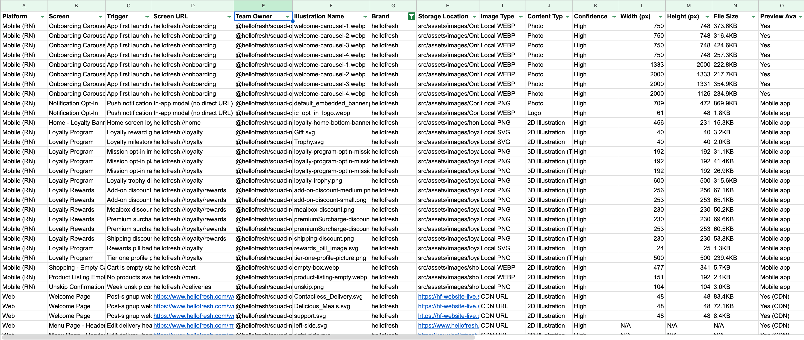
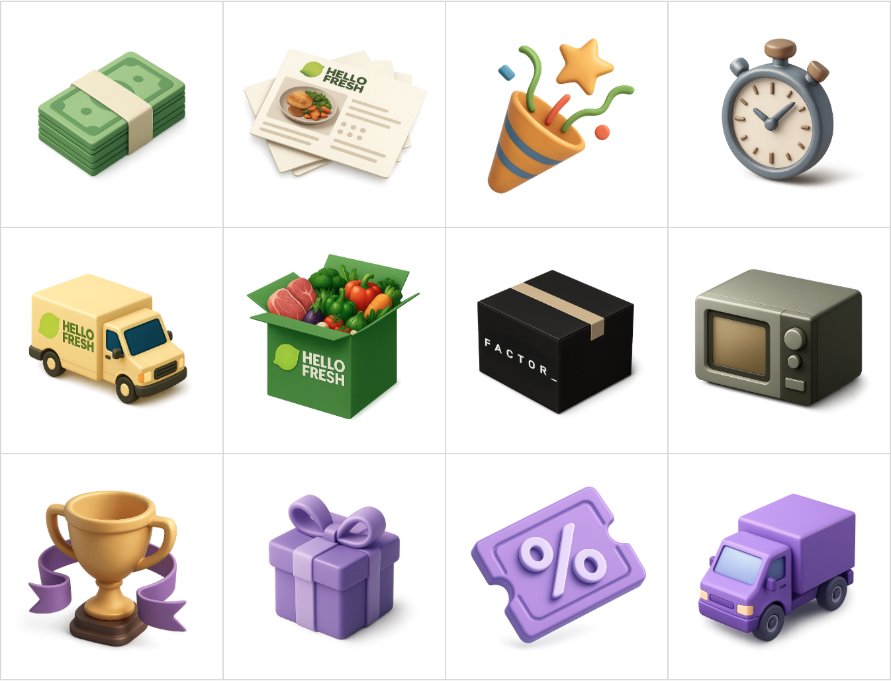

# AI Illustration Update: Scaling a Design Migration with AI

**Role:** Product Designer (Design Ops)
**Timeline:** Q1 2026 (ongoing)
**Scope:** Web, React Native | All brands (8)

---

## Overview

### The Challenge

In mid-2025, HelloFresh defined a new 3D illustration style to modernize the brand. But rollout stalled almost immediately.

The problem? **40 teams across 8 brands** had been storing and implementing their own illustrations for years. There was no centralized inventory, no clear ownership map, and assets lived in dozens of locations:

- Local files in 2 major repositories (Web + React Native)
- 8 different CDN domains
- Contentful CMS
- Inline SVG components buried in code

Nobody knew what existed, where it lived, or who owned it.

### Why I Was Brought In

I was asked to help unblock the migration because of my experience working embedded in engineering teams since joining HelloFresh. I had:

- Strong relationships with developers across squads
- Knowledge of the complexity from working on multi-brand, multi-domain rollouts
- A track record of bridging design and engineering gaps

> *"This would take months of manual searching. What if we used AI to do the audit instead?"*
> — My pitch to the team

### The AI-Assisted Approach

I proposed using AI tools to scale what would otherwise be months of tedious manual work. Claude Code could search codebases for image files. ChatGPT could help generate consistent replacement illustrations. Together, they could transform an overwhelming migration into a manageable, systematic process.

---

## The Audit

The first step was understanding what we were dealing with. I used Claude Code to systematically search both repositories.

### Discovery Method

Claude Code searched for SVG, PNG, and WebP files across the codebase, then helped classify each by content type, platform, and team ownership using CODEOWNERS files.

### What We Found

| Metric | Count |
|--------|-------|
| Total illustrations | 382 |
| Web illustrations | 265 |
| Mobile illustrations | 117 |
| CDN domains | 8 |
| Duplicates identified | 20 |

### Classification

| Category | Count |
|----------|-------|
| 2D illustrations (need replacement) | 207 |
| Already in 3D target style | 27 |
| Photos (case-by-case) | 81 |
| Animations (separate review) | 27 |

### Key Insight

Customer visibility became the most important prioritization factor. 197 illustrations were only visible to logged-in customers (high priority), while 91 appeared on public marketing pages (medium priority).

---

## Guidelines & AI Workflows

### Defining the Target Style

The new 3D style needed to be precisely defined so teams could create consistent illustrations—whether by hand or with AI assistance. I documented the key characteristics:

**Visual Characteristics:**
- Smooth, rounded "clay" or "plastic" surfaces
- Matte finish (not glossy or shiny)
- Soft shadows and ambient occlusion
- Simple, bold colors (gold, purple, green)
- Rounded edges, no sharp corners
- "Toy" or "Pixar" aesthetic

**Size Guidelines:**
- UI illustrations: 40px to 128px
- Scene illustrations: 256px to 1024px
- Mobile assets: Export at 3x (1080px minimum)
- Web assets: Export at 2x (1440px minimum)

### AI Generation Workflow

For new illustration requests, I created ChatGPT prompts that reliably produce on-brand results:

> *"Using this exact aesthetic, create a [description] with a clay-like aesthetic icon. Keep the background transparent."*
> — Base prompt template

I also developed a detailed JSON style specification that teams can use for more complex generation needs, covering perspective, lighting, textures, and color palette.

---

## Migration Approach

With the audit complete and guidelines established, I organized the cross-team migration effort:

### Prioritization Framework

We prioritized by customer impact:

1. **Priority 1:** Logged-in customer screens (197 illustrations) — active users see these daily
2. **Priority 2:** Logged-out public pages (91 illustrations) — affects acquisition
3. **Priority 3:** Design system components (6 illustrations) — cascades to multiple screens

### Low-Effort Implementation

The beauty of the audit was that it made replacement straightforward. Each row in the spreadsheet included:

- Exact file path or CDN URL
- Team owner (from CODEOWNERS)
- Screen where it appears
- Trigger conditions

Teams could use Claude Code to locate and replace files with minimal manual searching. What might have taken hours per illustration now took minutes.

---

## Results

The project is ongoing, but we've achieved significant milestones:

### Audit Outcomes

- **382 illustrations** catalogued across web and mobile
- **40 teams** now have clear ownership visibility
- **207 replacement candidates** identified and prioritized
- **20 duplicates** flagged for consolidation

### Process Improvements

- Illustration request workflow established via Jira
- AI prompts documented for consistent generation
- Guidelines published for all brands
- New illustrations already being created in target style

### What's Next

- Native iOS and Android audit (not yet covered)
- Zest design system integration for centralized storage
- Animation consistency guidelines

---

## Reflection

### What AI Enabled

This project wouldn't have been feasible without AI assistance. Manually searching two large repositories, opening hundreds of files, classifying each visually, and mapping ownership would have taken months. With Claude Code, I completed the audit in weeks—and with higher accuracy, since the AI could systematically check CODEOWNERS files and CDN patterns I might have missed.

### The Human Layer

AI handled the tedious discovery work, but the strategic decisions remained human. Prioritization by customer visibility, the decision to separate photos from illustrations for review, the choice to flag duplicates rather than auto-dedupe—these required judgment that understood the organizational context.

### What I'd Do Differently

**Include native apps earlier:** Native iOS and Android weren't in scope, but they'll need auditing eventually. Starting sooner would have given a complete picture.

**Prototype the migration flow:** Having teams actually replace a few illustrations during the audit phase would have surfaced implementation friction earlier.
