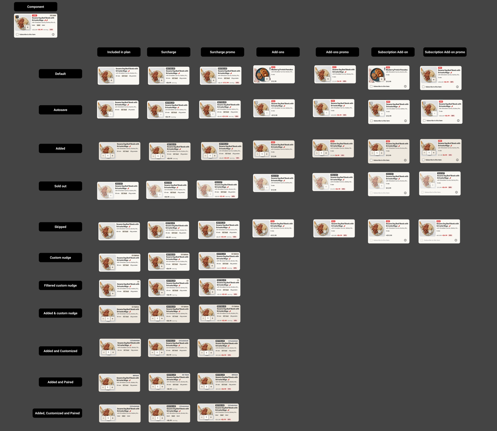
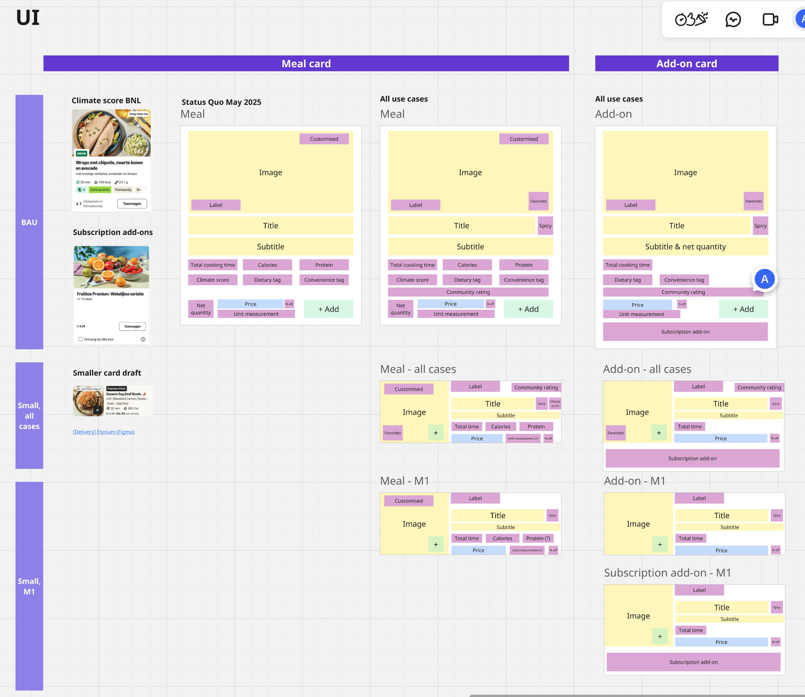
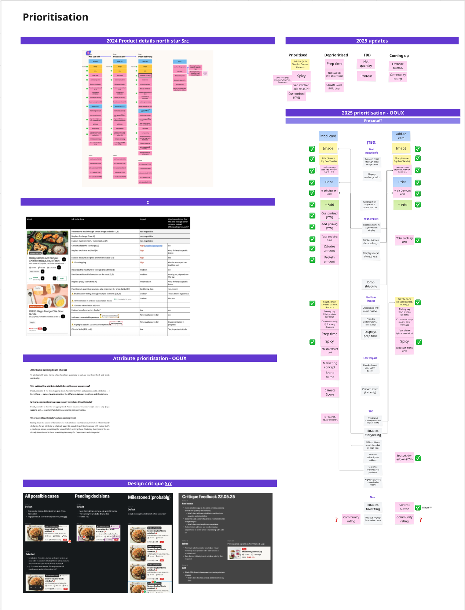

# Product Card Component: HelloFresh's First Accessible Multi-Brand Component

**Role:** Product Designer (Design Systems & Accessibility)
**Timeline:** Q1–Q2 2025
**Scope:** iOS, Android | Factor across 7 markets

---

## Overview

### The Context

This work was part of **Project Elysium**—a complete revamp of the HelloFresh mobile app Store experience. The product card is the highest-impact component in the Store: every customer uses it to make decisions and select their meals.

For the first time, we needed a component that worked across **both mealkit brands** (HelloFresh, Green Chef) **and Ready-to-Eat brands** (Factor)—each with fundamentally different product attributes.

### My Contribution

I collaborated with the HelloFresh Design System team to deliver a fully modular product card component. This was:

- The first component supporting mealkit + Ready-to-Eat multi-brand
- The first design-led accessibility implementation at HelloFresh
- Built using Object-Oriented UX (OOUX) principles

I also led knowledge sharing with the design team on accessibility from design to delivery.

---

## The Multi-Brand Challenge

### Different Products, Different Attributes

Previously, multi-brand components only needed to work across mealkit brands—which share the same product attributes. Factor (Ready-to-Eat) changed everything:

**Mealkit Products:**
- Cooking time and prep time
- Recipe steps and ingredients
- Serving size customization
- Spice level indicators
- Dietary tags (vegetarian, gluten-free)

**Ready-to-Eat Products:**
- No cooking required
- Protein and calorie focus
- Different dietary attributes
- Subscription add-on options
- Bulk buy variations

### OOUX: Object-Oriented UX

To solve this complexity, I used Object-Oriented UX to map all product types and their attributes. This involved:

- **Object mapping:** Identifying all product types (meals, add-ons, subscriptions) and their relationships
- **Attribute prioritization:** Aligning with product on Jobs to be Done to determine what information is essential vs. optional
- **Modular design:** Creating a component architecture that could flex based on content type

---

## Accessibility from Design to Development

### EAA Compliance

The European Accessibility Act (EAA) — Directive (EU) 2019/882 — becomes fully applicable on **June 28, 2025**. This meant our designs had to meet WCAG 2.1 AA standards.

This project became HelloFresh's first design-led accessibility implementation and audit initiative.

### Design Annotations

Using the Stark Figma plugin, I annotated every component with:

- Alt-text for images
- ARIA labels for interactive elements
- Reading order (based on OOUX prioritization)
- Focus order for keyboard navigation

### Text Resizing

Content must work at 200% text size without breaking layout. After discovering our truncation approach wouldn't maintain meaning, I benchmarked Lieferando's solution—switching to vertical layout at larger sizes.

### UX Writing Collaboration

Worked with UX Writing to ensure alt-text and ARIA labels conveyed meaning accurately. Adjustments were made directly in Figma, following our established collaboration workflow.

### Knowledge Sharing

I created a presentation for the design team: *"Elysium Product Cards Accessibility: From Design to Development"*—documenting the process, tools, and learnings so the approach could be replicated on future projects.

---

## Rollout & Validation

### Factor Launch

The product card component launched on **Factor (Ready-to-Eat)** with a controlled rollout across 7 markets: US, CA, DE, NL, BE, SE, and DK.

### HelloFresh Experiment

On HelloFresh, we tested a compact card variant. Results showed positive lift for prospects but negative impact for active customers—the change disrupted established browsing patterns. The experiment was rolled back.

### What's Next

A new design iteration is underway, informed by experiment insights and the 2026 Food First vision. The OOUX foundation and accessibility process established here will carry forward.

---

## The Solution

The final component is a modular system with **50+ variants** covering all states and brand configurations:

- **Product types:** Meals, add-ons, subscription add-ons
- **States:** Default, selected, paired, customized, discounted
- **Price variants:** Standard, surcharge, surcharge promo, bulk buy
- **Brand configurations:** HelloFresh, Factor, Green Chef

### Design Specifications

UI optimized for 360px width devices (based on user device analysis). Key specs included:

- Character limits for all text elements to prevent truncation issues
- Image aspect ratio 1:1, size 140x140px on mobile
- Touch targets meeting accessibility minimums
- Color contrast ratios meeting WCAG AA

### Design System Collaboration

Worked closely with the Zest Design System team—Saudin Cerić, Marin Metohu, and William Tolbize—to ensure the component met design system standards and could be maintained long-term.

---

## Results & Impact

- **Component live** on Factor across 7 markets (US, CA, DE, NL, BE, SE, DK)
- **First accessible product card** at HelloFresh with full WCAG 2.1 AA annotations
- **First mealkit + RTE multi-brand component**—establishing patterns for future cross-brand work
- **Accessibility process established:** design annotations → development handoff → testing workflow
- **Knowledge shared** with design team via presentation and documentation

---

## Reflection

### What I Learned

**OOUX enables accessibility.** The attribute prioritization exercise I did for UX design directly informed the reading order and focus order for screen readers. Good information architecture supports both visual and non-visual users.

**Process documentation matters.** By documenting the accessibility workflow, I created a repeatable process for the team. The presentation has been referenced on subsequent projects.

**Experiment insights are valuable even when rolled back.** The HelloFresh experiment showed that information density matters more than we assumed. Users need dietary tags and descriptions to evaluate products—they can't make decisions without them. This validated our OOUX prioritization and is informing the next iteration.
